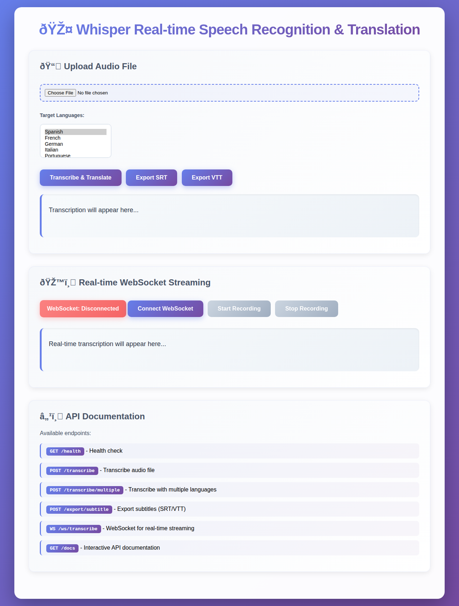

# Real-time Speech Recognition & Translation with Whisper Large V3

A production-ready real-time speech recognition and translation system powered by OpenAI's Whisper Large V3 model, integrated with Weights & Biases for MLOps and experiment tracking.

> 👨‍💻 **Developed by [Yash Kumar](https://www.linkedin.com/in/yash-kumar09/)** - Data Scientist & ML Engineer specializing in Speech Recognition and NLP

## 🌟 Features

- **State-of-the-art Speech Recognition**: Uses OpenAI's Whisper Large V3 model from HuggingFace
- **Real-time Processing**: Process audio streams in real-time with low latency
- **Multi-language Translation**: Automatic translation to any target language
- **MLOps Integration**: Built-in Weights & Biases integration for experiment tracking
- **Batch Processing**: Support for processing multiple audio files
- **GPU Acceleration**: Automatic GPU detection and utilization
- **Flexible Architecture**: Easy to customize and extend

## 🚀 Quick Start

### Prerequisites

- Python 3.8 or higher
- CUDA-compatible GPU (optional, but recommended for faster processing)
- Microphone for real-time speech recognition

### Installation

1. Clone the repository:
```bash
cd Realtime_Speech_Recognition_Translation_Whisper
```

2. Install dependencies:
```bash
pip install -r requirements.txt
```

3. (Optional) Set up Weights & Biases:
```bash
wandb login
# Or set your API key as environment variable
export WANDB_API_KEY=your_api_key_here
```

### Usage

#### Real-time Speech Recognition and Translation

Run the main script for real-time processing:

```bash
python realtime_speech_translator.py
```

The system will:
1. Load the Whisper Large V3 model
2. Start listening to your microphone
3. Transcribe your speech in real-time
4. Translate to the target language (Spanish by default)
5. Display results in the console

**Customize settings** by editing the configuration in `realtime_speech_translator.py`:
```python
MODEL_ID = "openai/whisper-large-v3"
TARGET_LANGUAGE = "es"  # Change to: fr, de, it, ja, zh, etc.
USE_WANDB = True  # Enable W&B logging
```

#### Batch Processing

Process audio files individually or in bulk:

```bash
# Process a single audio file
python batch_transcriber.py path/to/audio.wav

# Process with translation
python batch_transcriber.py path/to/audio.wav --target-language es

# Process entire directory and save results
python batch_transcriber.py path/to/audio_folder --target-language fr --output results.json

# Enable W&B logging
python batch_transcriber.py path/to/audio.wav --wandb
```

## 📁 Project Structure

```
Realtime_Speech_Recognition_Translation_Whisper/
├── README.md                          # Comprehensive documentation
├── QUICKSTART.md                      # Quick start guide
├── LICENSE                            # MIT License
├── requirements.txt                   # Python dependencies
├── config.py                          # Configuration file
├── .env.example                       # Environment variables template
│
├── realtime_speech_translator.py     # Main real-time application
├── batch_transcriber.py              # Batch processing script
├── example_usage.py                  # Interactive examples
├── quick_demo.py                     # Quick translation demo
├── test_setup.py                     # Setup verification
│
└── Whisper_Realtime_Demo.ipynb       # Jupyter notebook demo
```

## 📖 Documentation

- **[QUICKSTART.md](QUICKSTART.md)** - Get started in 5 minutes
- **[README.md](README.md)** - Full documentation (this file)
- **[LICENSE](LICENSE)** - MIT License details

## 🔧 Configuration

### Environment Variables

Create a `.env` file for configuration:

```env
# Weights & Biases
WANDB_API_KEY=your_wandb_api_key

# Model Configuration
WHISPER_MODEL_ID=openai/whisper-large-v3
TARGET_LANGUAGE=es

# Audio Configuration
SAMPLE_RATE=16000
CHUNK_DURATION=5.0
```

### Supported Languages

The system supports translation to any language supported by Google Translate:

- `es` - Spanish
- `fr` - French
- `de` - German
- `it` - Italian
- `pt` - Portuguese
- `ru` - Russian
- `ja` - Japanese
- `zh` - Chinese
- `ko` - Korean
- `ar` - Arabic
- And many more...

## 🏗️ Architecture

### WhisperRealtimeTranslator Class

The main class handles:
- Model initialization and loading
- Real-time audio capture
- Speech-to-text transcription
- Text translation
- W&B logging and monitoring

### Key Components

1. **Audio Capture**: Uses `sounddevice` for real-time microphone input
2. **Speech Recognition**: Whisper Large V3 via HuggingFace Transformers
3. **Translation**: Google Translate via deep-translator
4. **Monitoring**: Weights & Biases for experiment tracking

## 🎯 Use Cases

### 1. Real-time Meeting Translation
Transcribe and translate live meetings or presentations in real-time.

### 2. Podcast/Video Transcription
Process audio/video content with automatic translation.

### 3. Accessibility Tool
Provide real-time captions and translations for accessibility.

### 4. Language Learning
Practice speaking with instant transcription and translation feedback.

### 5. Customer Support
Transcribe and translate customer service calls.

## 📊 Performance

### Model Specifications

- **Model**: OpenAI Whisper Large V3
- **Parameters**: 1.5B
- **Languages**: 99+ languages
- **Architecture**: Transformer-based encoder-decoder

### Benchmarks

- **WER (Word Error Rate)**: ~5-10% on clean audio
- **Processing Speed**: ~1-2x real-time on GPU, ~0.3-0.5x on CPU
- **Latency**: ~2-5 seconds for 5-second audio chunks

### Hardware Requirements

**Minimum**:
- CPU: 4+ cores
- RAM: 8GB
- Storage: 5GB for model weights

**Recommended**:
- GPU: NVIDIA GPU with 6GB+ VRAM
- RAM: 16GB+
- Storage: 10GB+

## 🔬 Weights & Biases Integration

The project integrates with W&B for:

- **Experiment Tracking**: Log transcription metrics
- **Performance Monitoring**: Track processing times
- **Model Versioning**: Track different model configurations
- **Visualization**: Visualize transcription quality over time

Example W&B metrics logged:
- Transcription length
- Processing time per chunk
- Translation success rate
- Audio quality indicators

## 🛠️ Development

### Running Tests

```bash
# Install dev dependencies
pip install pytest pytest-cov

# Run tests
pytest tests/

# With coverage
pytest --cov=. tests/
```

### Code Quality

```bash
# Format code
black .

# Lint
flake8 .

# Type checking
mypy .
```

## 🚀 Extended Features (NEW!)

This project now includes advanced extensions with state-of-the-art capabilities:

### Core Features

- ✅ **Web Interface with FastAPI** - REST API and interactive web UI
- ✅ **WebSocket Support** - Real-time streaming communication
- ✅ **Multiple Language Translation** - Translate to multiple languages simultaneously
- ✅ **Custom Vocabulary** - Domain-specific term recognition
- ✅ **Audio Enhancement** - Noise reduction and preprocessing
- ✅ **Subtitle Export** - Generate SRT/VTT subtitle files

### Advanced AI Features

- 🆕 **Real-time Speaker Identification** - Pre-trained pyannote.audio models for accurate speaker recognition
- 🆕 **Deep Learning Emotion Detection** - wav2vec2 and SpeechBrain models for emotion analysis
- 🆕 **Video Processing with Subtitle Overlay** - Full video file support with embedded subtitles
- 🆕 **Advanced Noise Suppression** - RNNoise-based deep learning noise reduction
- 🆕 **Multi-channel Audio Support** - Beamforming and spatial audio processing

### Deployment & Integration

- 🆕 **Mobile App Integration** - Complete REST API for iOS, Android, and React Native
- 🆕 **Cloud Deployment Templates** - Docker, Kubernetes, AWS, GCP, Azure ready
- 🆕 **Production-Ready Infrastructure** - Auto-scaling, load balancing, monitoring

### Web Interface Preview



The web interface provides an intuitive way to interact with the speech recognition and translation system through your browser.

**Quick Start with Extended Features:**

```bash
# Start web interface with all features
python extended_translator.py --mode web --web-port 8000

# Process file with ALL advanced features
python extended_translator.py --mode file --file audio.wav \
    --languages es fr de \
    --speaker-diarization \
    --emotion-detection \
    --enhance-audio \
    --export-subtitle srt

# Process video with subtitle overlay
python video_processor.py video.mp4 --subtitle-format srt --overlay

# Real-time multi-channel processing with beamforming
python multichannel_audio.py --channels 4 --beamforming mvdr

# Advanced noise suppression
python advanced_noise_suppression.py noisy_audio.wav clean_audio.wav
```

**📖 Complete Documentation:**
- [EXTENDED_FEATURES.md](EXTENDED_FEATURES.md) - All feature details
- [MOBILE_INTEGRATION.md](MOBILE_INTEGRATION.md) - Mobile app integration guide
- [DEPLOYMENT.md](DEPLOYMENT.md) - Cloud deployment instructions

## 🤝 Contributing

Contributions are welcome! Please feel free to submit a Pull Request.

## 📝 License

This project is licensed under the MIT License - see the LICENSE file for details.

## 🙏 Acknowledgments

- **OpenAI** for the Whisper model
- **HuggingFace** for the Transformers library and model hosting
- **Weights & Biases** for MLOps platform
- **Google** for translation services

## 📚 References

- [Whisper Paper](https://arxiv.org/abs/2212.04356)
- [HuggingFace Whisper](https://huggingface.co/openai/whisper-large-v3)
- [Weights & Biases Documentation](https://docs.wandb.ai/)

## 🐛 Troubleshooting

### Common Issues

1. **"No module named 'pyaudio'"**
   - Install system dependencies: `sudo apt-get install portaudio19-dev python3-pyaudio`
   - Or use conda: `conda install pyaudio`

2. **CUDA Out of Memory**
   - Reduce batch size
   - Use CPU instead: set `device="cpu"` in configuration

3. **Audio not detected**
   - Check microphone permissions
   - List available devices: `python -c "import sounddevice; print(sounddevice.query_devices())"`

4. **Poor transcription quality**
   - Ensure good audio quality (minimal background noise)
   - Adjust `chunk_duration` for better context
   - Use noise reduction preprocessing

## 📧 Contact

### Project Author

**Yash Kumar** - Data Scientist & ML Engineer

[](https://www.linkedin.com/in/yash-kumar09/)

For questions, support, or collaboration opportunities:
- 💼 **Professional inquiries:** [linkedin.com/in/yash-kumar09](https://www.linkedin.com/in/yash-kumar09/)
- 🐛 **Bug reports & feature requests:** Open an issue on GitHub
- 🤝 **Contributions:** Pull requests are welcome!

---

**Built with ❤️ using OpenAI Whisper Large V3 and Weights & Biases**
